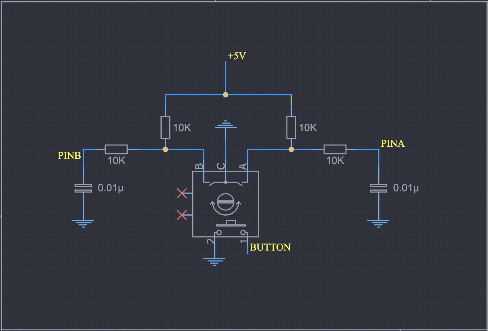

# SimpleEncoder

SimpleEncoder is a very simple, easy to use library for using rotary encoders with an Arduino.

To use it, you simply invoke the library by passing in the pin assignments from your encoder.

```c++
#include <SimpleEncoder.h>

const int BUTTON = 10;
const int PINA = 11;
const int PINB = 12;

SimpleEncoder encoder(BUTTON, PINA, PINB);
```

The library handles configuring the pins for you. Then to use the encoder, you can engage the library
in a couple of different ways, all of which need to be in your loop method.

```c++
void loop() {
    if (encoder.UP) {
        //Code for upward motion
    }
    if (encoder.DOWN) {
        //Code for downward motion
    }
}
```

SimpleEncoder can even keep track of a value that changes when the rotary is turned

```c++
#include <SimpleEncoder.h>

const int BUTTON = 10;
const int PINA = 11;
const int PINB = 12;
long myValue = 0;
long minValue = -100;
long maxValue = 100;

SimpleEncoder encoder(BUTTON, PINA, PINB, myValue, minValue, maxValue);
```

Then simply query the library for any changes in the encoder and if they exist, get the new value

```c++
void loop() {
    if(encoder.CHANGING) {
        myValue = encoder.VALUE;
    }
}
```

It's just that easy. 

There are two example sketches that show how to use the library.

These are the public methods in the library:

```
up() - Rotary moving clockwise
down() - rotary moving counter clockwise
buttonPressed() - Button was pressed
changing() - rotary is moving in either direction
idle() - rotary is idle and not changing
getValue() - get the value of the variable being tracked
```

And these are the alternate MACROS that can be used instead of the method names:

```
UP - Rotary moving clockwise
DOWN - rotary moving counter clockwise
BUTTON - Button was pressed
CHANGING - rotary is moving in either direction
IDLE - rotary is idle and not changing
VALUE - get the value of the variable being tracked
```

Make sure that your encoder has 5v connected to it - usually sourced from the Arduino, and that it is also connected to ground or things won't work properly.

Here is a schematic of how your rotary encoder should be connected. The yellow nodes
indicate where the encoder should be connected to the Arduino in accordance
with this library. 



If you're interested, [I made a PCB breakout board](https://oshwlab.com/sims.mike/rotaryencoderbasic) that I've already ordered and tested and it works perfectly.


Enjoy!